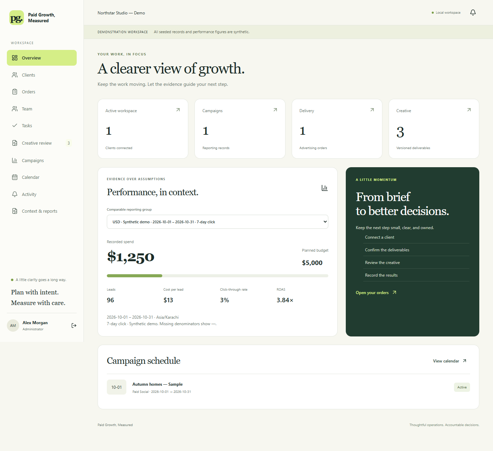

# Paid Growth, Measured

**A considered workspace for agency operations, grounded creative work, and accountable campaign decisions.**

Bring clients, orders, team assignments, creative review, campaign metrics, and client narratives together. Replace scattered records with a workflow that keeps responsibilities clear and decisions connected to evidence.



## Local MVP Features

- Client records with contacts, account ownership, follow-ups, and duplicate checks.
- Advertising orders with controlled status transitions and activity history.
- Restricted employee records and task ownership, deadlines, and completion states.
- Creative briefs, copy, HTTPS asset references, version links, comments, mentions, and approvals.
- Campaign scheduling for paid social, search, display, television, and outdoor work.
- Manual metric entry, validated CSV imports, filtered CSV exports, and comparable reporting groups.
- Versioned Client Context Packs with client-approved facts, sources, expiry dates, and prohibited wording.
- Template-based grounded copy with claim references, review flags, and format limits.
- Monthly reports and client-review summaries using timestamped metric snapshots, sequential approval, and PDF export.

This is a local first release. It does not connect to advertising platforms, send external messages, publish advertisements, process payments, or invoke an AI provider.

## Architecture

```text
frontend/   Next.js + TypeScript + Tailwind + Radix dialog component
backend/    FastAPI + SQLAlchemy + Alembic + PDF reporting
docs/       Specification, demonstration, permissions, and validation notes
compose.yaml PostgreSQL development service
```

The frontend proxies `/api` requests to FastAPI. HTTP-only opaque session cookies keep authentication tokens out of browser storage. Backend queries enforce agency and client boundaries. Versioned context content and campaign definitions live in validated JSON records; relationships, agencies, users, sessions, and audit records use relational tables.

## Prerequisites

- Node.js 20.9 or later and npm.
- Python 3.13 is recommended for this project.
- VS Code or another editor.
- Docker Desktop running for PostgreSQL; SQLite is available for a quick local walkthrough.

## Step 1 — Open the Project

```powershell
Set-Location 'D:\paid-growth-measured'
code .
Copy-Item .env.example .env
```

Edit `.env` privately. Set `DEMO_PASSWORD` to a unique password of at least 12 characters. Do not commit this file.

For a quick SQLite walkthrough, set:

```dotenv
DATABASE_URL=sqlite:///./paid_growth.db
```

For PostgreSQL, set matching `POSTGRES_*` values and `DATABASE_URL`, then run:

```powershell
docker compose up -d db
```

The database URL's password must be URL-encoded if it contains reserved URL characters. PostgreSQL binds only to localhost.

If a locally installed PostgreSQL service already uses port 5432, set `POSTGRES_PORT=5433` in `.env` and use `localhost:5433` in `DATABASE_URL`.

## Step 2 — Prepare and Run the Backend

In a PowerShell terminal at the project root:

```powershell
py -3.13 -m venv .venv
.\.venv\Scripts\python.exe -m pip install -r backend\requirements.txt
Set-Location backend
..\.venv\Scripts\python.exe -m alembic upgrade head
..\.venv\Scripts\python.exe -m app.seed
..\.venv\Scripts\python.exe -m uvicorn app.main:app --host 127.0.0.1 --port 8000
```

API documentation: [http://localhost:8000/docs](http://localhost:8000/docs).

For the exact Python dependency versions used in validation, install `backend/requirements.lock` instead of `backend/requirements.txt`. Mutating API requests require the header `X-Requested-With: PaidGrowth`; the application sends it automatically.

If Windows cannot bootstrap pip into the virtual environment, use an existing pip installation to populate the isolated environment:

```powershell
# Run from the project root after the virtual environment directory is created.
python -m pip --python .venv install -r backend\requirements.txt
```

## Step 3 — Run the Frontend

In a second terminal:

```powershell
Set-Location 'D:\paid-growth-measured\frontend'
npm.cmd ci
npm.cmd run dev
```

Open [http://localhost:3000](http://localhost:3000). Keep this exact origin; the backend checks it for browser writes.

## Demo Accounts

All seeded users use the private `DEMO_PASSWORD` you configured. These are fictional local accounts.

| Role | Email |
| --- | --- |
| Agency Administrator | admin@example.test |
| Account Manager | manager@example.test |
| Campaign Specialist | campaigns@example.test |
| Creative Team Member | creative@example.test |
| Client Viewer/Approver | client@example.test |

The seed command is idempotent and does not change existing accounts. Editing `DEMO_PASSWORD` after seeding does not reset stored passwords.

## Permissions

- Administrators and Account Managers manage operational client/order/team records.
- Campaign specialists manage campaigns and tasks.
- Creative staff manage creative drafts and tasks.
- **Only Account Managers edit Context Packs. Administrators do not inherit this permission.**
- Clients see only their own client record, campaign records, reviewable creative, approved facts, and reports released for client approval.
- Fact approval requests use a separate review view. The approved-facts view contains only facts approved by that client user.
- Report approval follows **Account Manager → Client**. Neither approval publishes anything externally.

See [permissions](docs/PERMISSIONS.md) for the full matrix.

## Grounded Copy and Reports

The template provider inserts exact approved fact text with `[fact:id]` references. It flags expired or unapproved facts, unknown references, prohibited wording, unsupported text, and format overflow. Generated drafts cannot be submitted while flagged. Claim checks run again at creative approval.

Brand voice, audience, campaign objective, channel, and compliance notes form the generated brief. The first-release copy template is deliberately limited; it does not creatively paraphrase claims. Offers must be represented as approved facts before appearing as factual promotional copy.

Each report snapshots stored metrics and their date range, currency, source, timezone, and attribution label. The application provides no freeform numeric narrative editor. Reports separate **Results → Interpretation → Recommendations → Open questions**. Later metric changes require a new report.

See [the demonstration](docs/DEMO.md) for the complete workflow.

## Validation Commands

```powershell
# From backend/
..\.venv\Scripts\python.exe -m pytest -q

# From frontend/
npm.cmd run typecheck
npm.cmd run build
```

See [validation notes](docs/VALIDATION.md) for the checks actually performed and their limitations.

## Important First-Release Boundaries

- Creative files use HTTPS references. Binary uploads and a graphic editor are not implemented.
- Internal notes and comments are text-only; no attachment store is included.
- Campaign metrics are cumulative for each stored reporting period. No daily trend series or vendor synchronization is included.
- The calendar shows scheduled campaign periods; drag-and-drop scheduling is future work.
- CSV imports add campaign records and reject duplicate rows within the submitted batch. Imports are not upserts.
- In-app notifications show recent mentions and creative decisions; read/unread tracking is future work.
- Context and report lists currently show the latest 100 records; operational modules have pagination.
- Report revisions are prepared as new reports. Slide decks and configurable LLM adapters are future work.
- The local MVP uses application-layer agency filtering; database row-level security is not configured.
- Production deployment needs TLS, secure cookies, backup testing, ingress rate limits, monitoring, and security review.

## License

MIT. Copyright © 2026 Asadullah Shafique.
